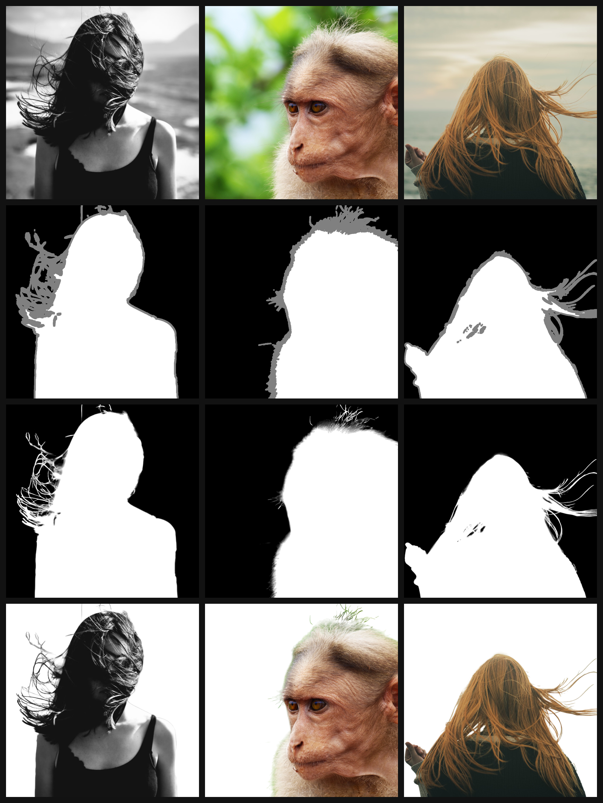

**English** | [Русский](README_ru.md)

# AlphaGAN for Image Matting

<p align="center">
  
</p>

Unofficial implementation of the **AlphaGAN** training pipeline for **image matting** (recovering an alpha matte from an image and a trimap), based on the paper:  
[AlphaGAN: Generative adversarial networks for natural image matting](https://arxiv.org/pdf/1807.10088)

## Contents
- [Project overview](#project-overview)
- [Repository structure](#repository-structure)
- [Dependency installation](#dependency-installation)
- [Data preparation](#data-preparation)
- [Configs](#configs)
  - [Config example](#config-example)
  - [Config field descriptions](#config-field-descriptions)
- [Training](#training)
- [Losses and validation](#losses-and-validation)
- [Checkpoints and logging](#checkpoints-and-logging)
- [Model input and output](#model-input-and-output)
- [Inference](#inference)
- [References](#references)
- [License](#license)

---

## Project overview

**AlphaGAN** targets alpha matte recovery (transparency) in the unknown trimap region using GAN components and matting-specific losses.

This repository includes:
- model architectures (generator, discriminator, and building blocks)
- losses and metrics
- training pipeline (train and test)
- dataset pipeline and transforms
- TensorBoard logging and checkpoints

---

## Repository structure

```
.
├── assets/                  # README visuals and previews
├── configs/                 # YAML configs for training and testing
├── losses/                  # Loss implementations
├── models/                  # Model architectures and components
├── train_pipeline/          # Train/test steps and epoch loop
├── transforms/
│   ├── models/              # Transform building blocks
│   └── trans_pipeline.py    # Transform pipeline for train/test data
├── cfg_loader.py            # Config loading from configs/config.yaml
├── dataset.py               # Dataset, archive unpacking, CSV label generation
├── inference.py             # ONNX inference script
├── main.py                  # Entry point: initialization and training start
├── onnx_export.py           # ONNX export script
├── schemas.py               # Dataclasses for training state, losses, and metrics
└── utils/                   # Seed, logging, checkpointing, and train helpers
```

---

## Dependency installation

The project uses `Python >=3.13` and the `PyTorch` framework.

Example installation with `uv`:

If `uv` is not installed yet, follow the instructions [here](https://docs.astral.sh/uv/)

```bash
uv sync
```

---

Example installation with `pip`:

```bash
python -m venv .venv
source .venv/bin/activate
pip install -r requirements.txt
```

---

## Data preparation

Datasets used for training:
- For the foreground part, my own dataset with 506 object samples was used.

- For the background part, the [BG20K](https://www.kaggle.com/datasets/nguyenquocdungk16hl/bg-20o) dataset was used.

`dataset.py` contains:
- dataset class for train/test
- archive unpacking helpers
- `dataset_labels.csv` generation with paths to `original`, `trimap`, `mask`, and the `split` field (`train` / `test`)

### Expected directory layout

The label-generation code expects the following tiled dataset structure:

```text
<root>/
  dataset/
    NAME_OF_DATASET/
      part01/
        sample_0001/
          composite_crops/
          alpha_crops/
          trimap_crops/
        sample_0002/
          composite_crops/
          alpha_crops/
          trimap_crops/
      part02/
        sample_0003/
          composite_crops/
          alpha_crops/
          trimap_crops/
      ...
```

Requirements:
- each `partXX` directory must contain sample subdirectories
- each sample directory must contain `composite_crops`, `alpha_crops`, and `trimap_crops`
- each crop must exist in all three folders with the same filename

### Usage example

1) Unpack archives:

```python
from pathlib import Path
from dataset import unpack_archives

dt_path = Path(__file__).parent / "dataset" / "IMDatasetTiled.zip"
dst_path = Path(__file__).parent / "dataset"

unpack_archives(dt_path, dst_path)
```

2) Generate `dataset_labels.csv`:

```python
from pathlib import Path
from dataset import prepare_dataset_labels

dt_path = Path(__file__).parent / "dataset" / "IMDatasetTiled"
output_path = Path(__file__).parent / "dataset" / "dataset_labels.csv"

prepare_dataset_labels(dt_path, output_path)
```

---

## Configs

Configs use the `.yaml` format. The active config is loaded from `configs/config.yaml` by `cfg_loader.py`.

### Config example

```yaml
general:
  random_seed: 1669
  mean: [0.485, 0.456, 0.406]
  std: [0.229, 0.224, 0.225]
  batch_size: 5
  checkpoints_dir: checkpoints/
  log_dir: tb_logger/
  colab:
    use_colab: 0
    best_chkp_name: best_chkp
    last_chkp_name: last_chkp

train:
  use_gan_loss: 1
  save_chkp_n_epoches: 1
  resize_size: 256
  D:
    update_n_batches: 1
    scheduler:
      start_lr: 1e-5
      end_lr: 1.5e-4
      step_size_up: 4000
  G:
    scheduler:
      start_lr: 1e-4
      end_lr: 3e-3
      step_size_up: 4000
  optimizer:
    weight_decay: 5e-4
  logging:
    log_io_n_batches: 10
    log_lr_n_batches: 50
    log_curr_loss_n_batches: 10
    log_grad_n_batches: 10
    log_random_weights_n_batches: 10
  epoches: 5000
  losses:
    lambda_gan_g: 0.15
    alpha_loss:
      lambda_alpha_g: 1.0
      use_weighted_option: 1
      unknown_weight: 4
      bg_weight: 4
      fg_weight: 4
    compos_loss:
      lambda_comp_g: 1.0
      use_weighted_option: 1
      unknown_weight: 4
      fg_weight: 4
  amp:
    use_amp: 1
    dtype: bf16
    use_grad_scaler: 0

test:
  resize_size: 256
  logging:
    log_curr_mets_n_batches: 1
    log_io_n_batches: 10
```

### Config field descriptions

#### `general`
- `random_seed`  
  Seed for reproducibility.
- `mean`, `std`  
  ImageNet normalization parameters used by the generator and the VGG feature extractor.
- `batch_size`  
  Batch size.
- `checkpoints_dir`  
  Directory for saving checkpoints.
- `log_dir`  
  Directory for TensorBoard logs.
- `colab.use_colab`  
  Enables a Colab and Google Drive friendly mode (useful when disk space is limited).
- `colab.best_chkp_name`, `colab.last_chkp_name`  
  Base filenames for best and last checkpoints.

#### `train`
- `use_gan_loss`  
  Enable the GAN loss term. If `0`, the adversarial component is disabled.
- `save_chkp_n_epoches`  
  Save a checkpoint every `N` epochs.
- `resize_size`  
  Resize side length used by the training transform pipeline.
- `D.update_n_batches`  
  Update the discriminator once per `N` batches.
- `D.scheduler`, `G.scheduler`  
  Scheduler parameters: `start_lr`, `end_lr`, `step_size_up`.
- `optimizer.weight_decay`  
  Weight decay for the optimizer.
- `logging`  
  TensorBoard logging settings.
  - `log_io_n_batches`  
    Log input/output examples every `N` batches.
  - `log_lr_n_batches`  
    Log learning rate every `N` batches.
  - `log_curr_loss_n_batches`  
    Log current losses every `N` batches.
  - `log_grad_n_batches`  
    Log gradients every `N` batches.
  - `log_random_weights_n_batches`  
    Log randomly selected model weights every `N` batches.
- `epoches`  
  Number of training epochs.
- `losses`  
  Weights for the generator loss terms:
  - `lambda_gan_g` GAN term weight for G
  - `lambda_alpha_g` alpha loss weight (error between GT and predicted alpha)
  - `alpha_loss.use_weighted_option` enables the weighted alpha loss
  - `alpha_loss.unknown_weight` weight for the unknown region in alpha loss
  - `alpha_loss.bg_weight` weight for the background region in alpha loss
  - `alpha_loss.fg_weight` weight for the foreground region in alpha loss
  - `lambda_comp_g` composition loss weight (error between GT composite and composite built with predicted alpha)
  - `compos_loss.use_weighted_option` enables the weighted composition loss
  - `compos_loss.unknown_weight` weight for the unknown region in composition loss
  - `compos_loss.fg_weight` weight for the foreground region in composition loss
- `amp`  
  Mixed precision (automatic mixed precision) settings.
  - `use_amp`  
    Enable AMP. If `0`, training runs in fp32.
  - `dtype`  
    Autocast dtype, `bf16` or `fp16`.
  - `use_grad_scaler`  
    Use gradient scaling. Usually needed for `fp16`, often optional for `bf16`.

#### `test`
- `resize_size`  
  Resize size during testing.
- `logging.log_curr_mets_n_batches`  
  Metric logging frequency during testing: once per `N` batches.
- `logging.log_io_n_batches`  
  Log input/output examples every `N` batches.

Notes:
- Training uses `AdamW` and `CyclicLR`.
- The config path is set in `cfg_loader.py`.

---

## Training

`main.py` currently uses a hardcoded path to the labels CSV in the `__main__` block:

```python
if __name__ == "__main__":
    csv_path = Path(__file__).parent / "dataset" / "dataset_labels.csv"
    main(csv_path)
```

Update this path if your labels file is stored elsewhere.

Run with `uv`:

```bash
uv run python main.py
```

Or from an activated virtual environment:

```bash
python main.py
```

---

## Losses and validation

The current training code uses the following loss components:

- `LAlphaLoss` for alpha matte supervision
- `LCompositeLoss` for compositional consistency
- `GANLoss` for adversarial training with a PatchGAN discriminator
- `PerceptualLoss` with a VGG feature extractor for validation and monitoring

In the current implementation, the discriminator receives:

- **real**: the target composite RGB image with the trimap as the 4th channel
- **fake**: the generated composite RGB image with the trimap as the 4th channel

Validation currently logs:

- alpha loss
- compositional loss
- perceptual loss

The best checkpoint is selected using validation perceptual loss in `train_pipeline/train_main.py`.

## Checkpoints and logging

- checkpoints are saved to `general.checkpoints_dir`
- TensorBoard logs are written to `general.log_dir`

Run TensorBoard:

```bash
tensorboard --logdir=./tb_logger --bind_all --samples_per_plugin "images=1000, scalars=100000"
```

## Model input and output

The model takes a **4-channel input tensor**:

- `RGB` image
- `trimap` as the 4th channel

The trimap acts as an explicit spatial prior that marks known background,
known foreground, and unknown regions.

The model predicts a **single-channel alpha matte** for the input image.

## Example outputs

<p align="center">
  
</p>

---

## Inference

An ONNX checkpoint can be downloaded [here](https://drive.google.com/file/d/1VEr-O4uWJzuRTkdZn7tTlNjSaNf3qrkq/view?usp=sharing).

The repository also includes:

- [inference.py](./inference.py) for ONNX Runtime inference
- example inputs in [inference_test](./inference_test/)

By default, `inference.py`:

- loads the ONNX model from the repository root
- reads `inference_test/orig.png` and `inference_test/trimap.png`
- runs tiled inference over unknown trimap regions
- writes `*-alpha.png` and `*-cutout.png` files to `results/`

Run:

```bash
python inference.py
```

If needed, edit the constants in the `__main__` block of `inference.py` to point
to your own ONNX model and input images.


## References
- Sebastian Lutz, Konstantinos Amplianitis, Aljosa Smolic. "AlphaGAN: Generative adversarial networks for natural image matting." arXiv:1807.10088, 2018.

---

## License
This project is licensed under the MIT License. See `LICENSE`.
